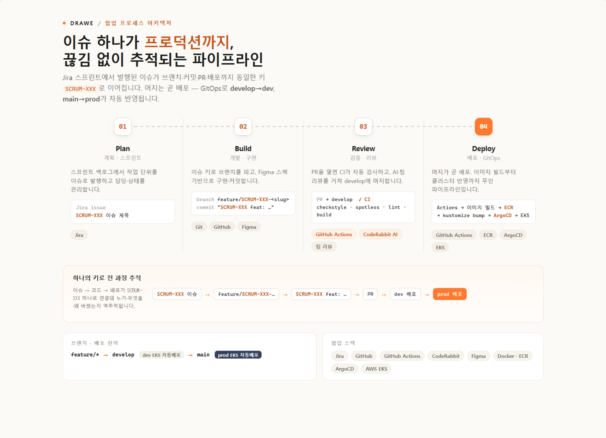

# Drawe — 백엔드 (AI 레퍼런스 추천 · 검색 · 인증)

> **그림 레퍼런스 검색 & AI 드로잉 피드백 서비스 Drawe** 의 팀 저장소입니다.
> 저는 **백엔드**로 참여해 **AI 레퍼런스 추천 파이프라인 · 검색 · 인증 · 데이터 적재**를 담당했습니다.
> · 2026.04 – 2026.07_

> - 🔬 제가 설계·구현한 **AI 추천 백엔드 상세**(파이프라인 심화): **[YujinB/drawe-ai-backend](https://github.com/YujinB/drawe-ai-backend)**
> - 🖼 **한 끗 가이드(이미지 코칭)·인프라는 팀원 담당**입니다. 제품 전체 소개·아키텍처는 [`docs/SDS/`](docs/SDS/README.md) 참고.
> - 🗂 원본 팀 레포(이슈·PR·리뷰 이력): [DraWeTeam/drawe](https://github.com/DraWeTeam/drawe)

---

## 🙋 담당 역할 (백엔드)

인증·데이터·추천·검색 도메인을 중심으로 3개 라운드에 걸쳐 참여했습니다.

- **인증·계정** — Google OAuth2 로그인, 비밀번호 재설정
- **데이터** — 초기 레퍼런스 데이터 적재·전처리(공통 구조화)
- **AI 레퍼런스 추천** — 키워드 추출 파이프라인, CLIP + Tag IDF 하이브리드 re-rank, 핀 레퍼런스 분리 주입, 멀티턴 세션·토큰 비용 최적화 *(→ 심화: [drawe-ai-backend](https://github.com/YujinB/drawe-ai-backend))*
- **레퍼런스 보드** — 키워드 검색 + 좋아요/싫어요 피드백 루프 (피벗 후 재설계)
- **프로젝트** — 생성·수정, 정렬·전역 검색 (백엔드 + 프론트 UI 연동, 풀스택)
- **온보딩 · 이미지 피드백**

---

## 💡 문제 해결 경험

> **배경** — 초기엔 레퍼런스 추천을 **LLM 채팅에 직접 연결**했지만, 대화 흐름 안에서는 **LLM 응답 품질도 추천 품질도 안정적으로 나오지 않았습니다.** 이를 계기로 추천을 **단계형 AI 파이프라인**(의도 라우팅 → 키워드 추출 → 하이브리드 검색 → 합성·무결성)으로 재설계하고, 아래 문제들을 하나씩 해결했습니다.

### 1. 레퍼런스 추천 정확도 — 데이터와 사용자 의도 제어

- **문제** — 초기 데이터의 다양성 부족·불규칙한 구조로, 엉뚱한 결과나 **데이터에 없는 주제에 무관한 이미지가 인용**되는 문제가 반복됐습니다.
- **해결** — 데이터를 공통 구조로 전처리하고, 프롬프트를 반복 테스트로 다듬고, **사용자 의도에 따라 검색을 제어**하며 유사도가 낮은 결과는 차단했습니다.
- **배움** — 데이터·의도에 따라 결과가 크게 달라지므로 **실패 케이스를 분석·보완하는 설계**가 핵심임을 배웠습니다.

### 2. 한국어 자유 입력 → 검색 신호 (키워드 추출 + 하이브리드 re-rank)

- **문제** — 형태소 분석의 복합어 분리·불필요한 키워드 문제, 그리고 추천 설명 과정에서 **LLM의 부정확한 응답(할루시네이션)**.
- **해결** — 미술 **사용자 사전 확장 + 불용어 처리**로 키워드 품질을 개선하고, **실제 캡션(ai_description) 주입 + CLIP 유사도·Tag IDF 하이브리드 re-rank + 핀 레퍼런스 분리 주입**으로 정확도와 설명 신뢰도를 높였습니다. 멀티턴 대화는 토큰 예산 기반으로 맥락을 관리했습니다.
- **배움** — AI 기능은 **실제 데이터 기반 신호 + 기능별 역할 분리**가 중요함을 배웠습니다.

### 3. 멀티턴 대화 토큰 비용 최적화

- **문제** — 멀티턴 대화가 길어질수록 커지는 토큰 비용.
- **해결** — Grok **대화 단위 프롬프트 캐시 라우팅** + 토큰 예산 기반 **히스토리 트리밍(청크 방식)**으로 캐시 prefix를 안정화해 캐시 적중률을 높였습니다.

### 4. 피벗 대응 — 추천 UX 재설계 (채팅 → 검색 보드)

- **문제** — 방향 전환으로, 기존 **채팅 대화 흐름 안의 추천**을 **키워드 검색 기반 레퍼런스 보드 노출**로 전환해야 했습니다.
- **해결** — 대화 맥락에 묶여 있던 추천 로직을 **검색 피드백 중심으로 분리**하고, 검색어가 바뀌면 노출 이력을 리셋해 신선도를 유지하며, 좋아요/싫어요 피드백을 다음 검색에 반영하는 루프로 재구성했습니다.
- **배움** — 비용을 고려한 설계와, **방향 전환 상황에서 기존 로직을 목적에 맞게 분리·재구성**하는 역량을 길렀습니다.

---

## 🛠 기술 스택 (백엔드)

`Java 17` · `Spring Boot 3.2` · `Spring Security / OAuth2` · `JPA` · `QueryDSL` · `Flyway` · `MySQL` · `Redis(Valkey)` · `WebFlux(WebClient)` · `Pinecone(벡터 검색)` · `LLM(Grok·Claude·Gemini)`

> 배포는 AWS EKS(Graviton) · ArgoCD GitOps · OpenTelemetry (인프라 팀원 담당). 전체 스택은 [`docs/SDS/`](docs/SDS/README.md) 참고.

---

## 🤝 협업 · 개발 프로세스

- **Jira(SCRUM) ↔ GitHub** — 이슈 단위로 브랜치·커밋·PR을 `SCRUM-###` 키로 연결, 릴리스 PR로 배포.
- **PR 리뷰** — feature 브랜치 → PR → 팀 리뷰 + **CodeRabbit AI** → `develop` 머지, `main` 배포(EKS 자동배포).
- **품질 게이트** — Spotless · Checkstyle · CI format/build 검증.
- **디자인 정합** — Figma 와이어프레임+annotation을 단일 정본으로 화면 개발.

---

## 📚 링크

- 🔬 [YujinB/drawe-ai-backend](https://github.com/YujinB/drawe-ai-backend) — 제가 설계·구현한 **AI 레퍼런스 추천 백엔드 심화** (파이프라인 단계별 설계)
- 📐 [`docs/SDS/`](docs/SDS/README.md) — 시스템 설계 문서 (아키텍처·데이터·다이어그램)
- 📦 [`backend/README.md`](backend/README.md) · [`fastapi/README.md`](fastapi/README.md) · [`frontend/README.md`](frontend/README.md) · [`infra/README.md`](infra/README.md) — 각 파트 상세
- 🔗 [DraWeTeam/drawe](https://github.com/DraWeTeam/drawe) — 원본 팀 레포 (이슈·PR·리뷰 이력, 내 PR: `is:pr author:YujinB`)
